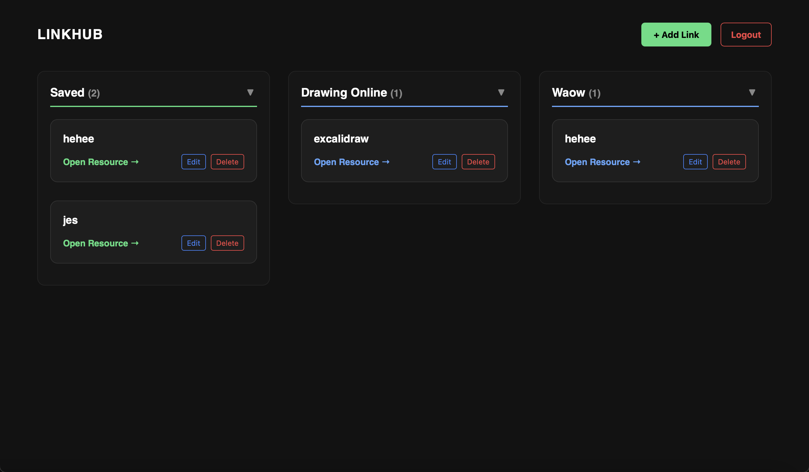
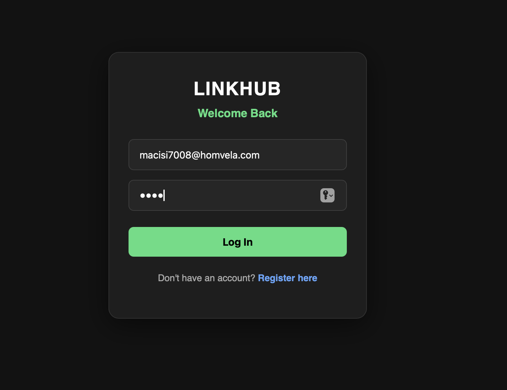
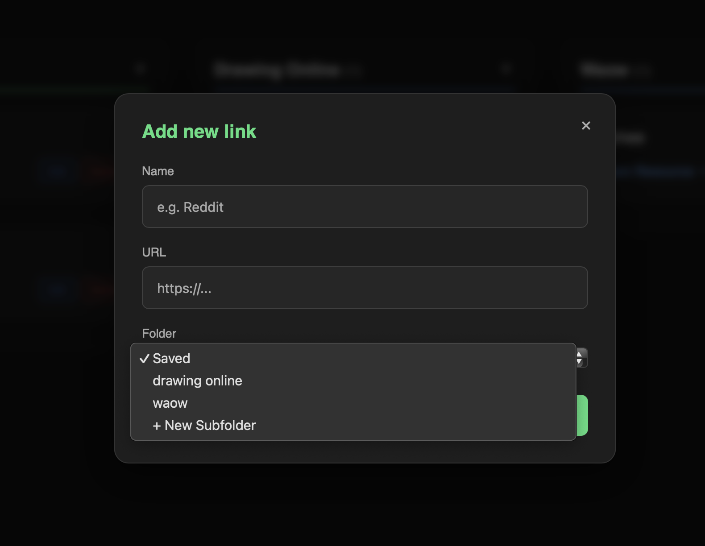

# 🔗 LinkHub

 
*Replace the link above with a wide screenshot of your main dashboard.*

LinkHub is a sleek, full-stack bookmarking and resource management dashboard. It allows users to securely save, categorize, and organize their most important links in a clean, modern, dark-themed interface.

## ✨ Features

* **Secure Authentication:** Full user registration and login system protected by JSON Web Tokens (JWT) and bcrypt password hashing.
* **Smart Categorization:** Automatically groups links into custom, user-defined folders.
* **Interactive UI:** Expandable/collapsible subfolders and a beautiful, blurred modal for adding new resources.
* **Bulletproof Data:** Complete CRUD (Create, Read, Update, Delete) operations, with backend middleware ensuring users can only modify their own data.
* **Resilient Design:** Built-in "Server Offline" detection gracefully handles backend disconnections without crashing the frontend.

## 📸 Screenshots

| Login Page | Add Link Modal |
| :---: | :---: |
|  |  |
| *Clean, grid-based layout for saved resources.* | *Sleek UI for categorizing new links.* |

## 🛠️ Tech Stack

**Frontend:**
* React.js
* CSS/Inline Styles (Custom Dark Theme)
* Fetch API for asynchronous requests

**Backend:**
* Node.js & Express.js
* MongoDB & Mongoose (Database & Modeling)
* JSON Web Tokens (JWT) for secure route authorization
* bcryptjs for password encryption

---